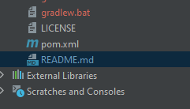
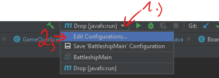
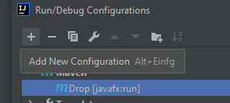
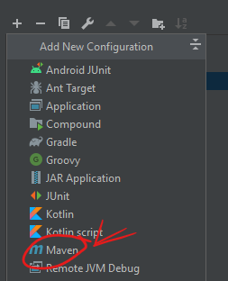
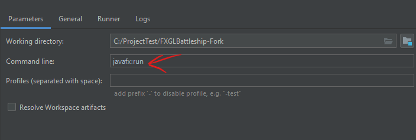

##This is a university Project based on AlmasB's template

For the original template, go to https://github.com/AlmasB/FXGL-MavenGradle

##Uses Maven:
if maven is not available on you right side build tab, right click on pom.xml

and click on "add as maven project"

after that, click Configurations and "Edit Configurations..."

then add new config:

and add command line parameter for javafx:

